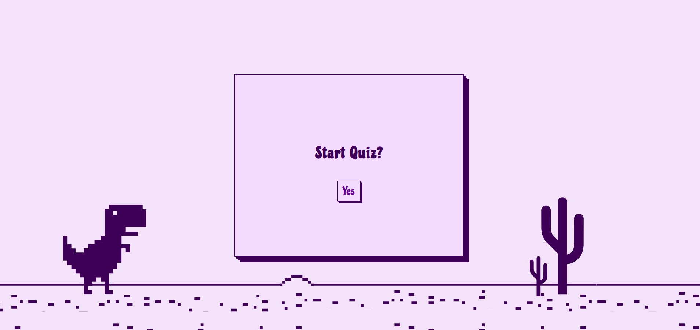

# Quiz Game

_Easy quiz about CSS and Javascript._

 

## Getting Started

### Play the Quiz 
[Depolyed Game](https://ma-all.github.io/quiz-game-project/)

### How to Play
1. Press the start button.
2. Choose the category.
3. Click on one of the answer options.

### Installation
No installation required! Simply clone the repo to your machine and open `index.html` file in your browser.

```bash
git clone
cd quiz-game-project
open index.html
```

### Technologies Used
- **HTML**
- **CSS**
- **Javascript**

### Future Enhancements
- Add more questions.
- Add easy, medium, hard modes.

### Credits
- Canva was used for the background image.
- I'd like to thank Bidoor and Zainab for their help.